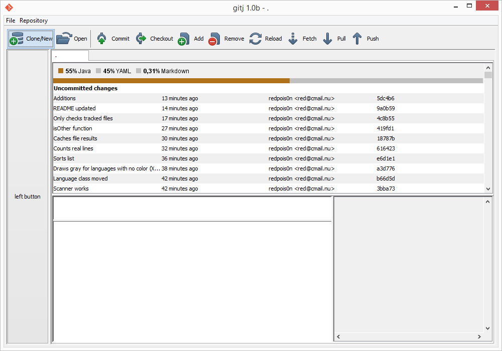

#  gitj
### Java Git client

Built from my experience with git, as I learn more, this software will expand.
Focus on graphics

## Currently not supported

- Pushing
- Pulling
- Fetching
- Anything with branches (supports checkout)
- Bookmarks
- ...

## Screenshot(s)

_at 627874114fac390c42c2779d7469b35646c87dd2_



## How to build

Compile from source into an runnable JAR with [pyjar](https://github.com/redpois0n/pyjar)

Put pyjar.py in the same directory as the downloaded source and run

```
python pyjar.py [--jdk /path/to/jdk/bin/] --input src --output gitj.jar --mainclass com.redpois0n.gitj.Main
```

*--jdk argument is only needed if javac isn't in your **$PATH***

Then you can either double click the JAR or run it using

```
java -jar gitj.jar
```

## Tested with

- Git version **1.9.5** (Windows)
- Git version **1.9.1** (Linux)