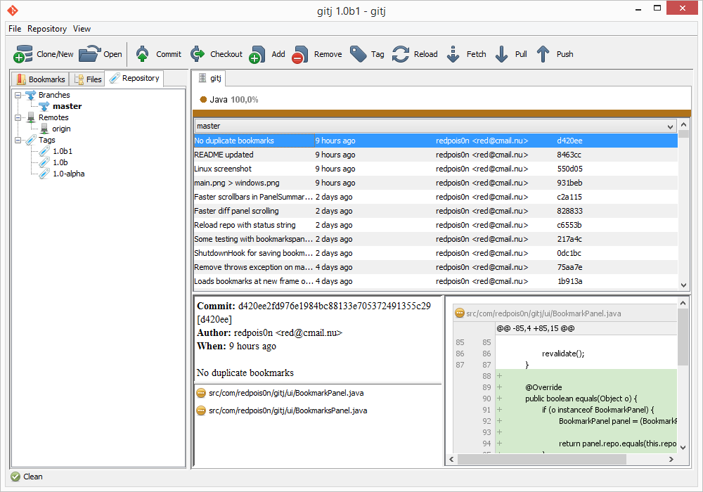
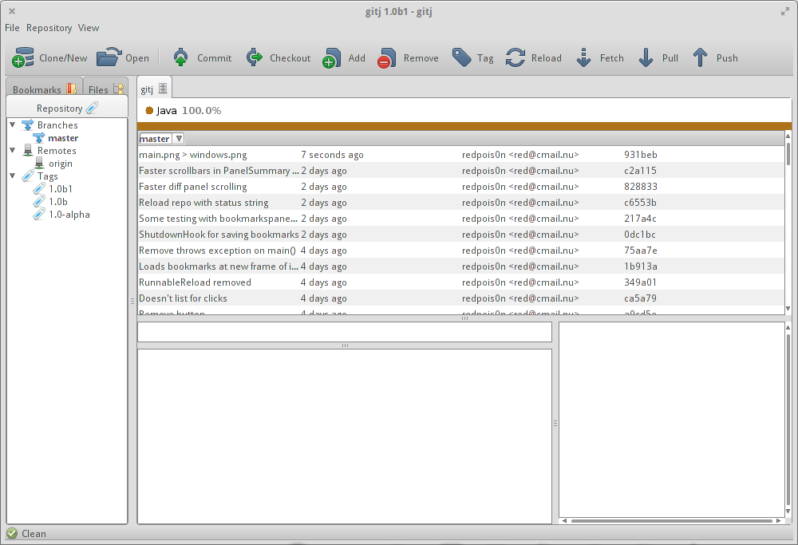

#  gitj
### Java Git client

Built from my experience with git, as I learn more, this software will expand.
Focus on graphics

## Screenshot(s)

_at 2dfab43de7b96183dbcded830284bfdc1e5cee19_





## How to build

Compile from source into an runnable JAR with [pyjar](https://github.com/redpois0n/pyjar)

Put pyjar.py in the parent directory of the downloaded source and run

```
python pyjar.py [--jdk /path/to/jdk/bin/] [--classpath graphslib.jar:pathtree.jar:oslib.jar:iconlib.jar] --input src --output gitj.jar --mainclass com.redpois0n.gitj.Main
```
_path separator depends on system, ; for Windows, : for *nix_

*--jdk argument is only needed if javac isn't in your __$PATH__*

Then you can either double click the JAR or run it using

```
java -jar gitj.jar
```

## Requirements

- [graphslib](https://github.com/redpois0n/graphslib)
- [pathtree](https://github.com/redpois0n/pathtree)
- [iconlib](https://github.com/redpois0n/iconlib)
- [oslib](https://github.com/redpois0n/oslib)

Either extract the files into the src folder when using pyjar or use the --classpath argument graphslib.jar:pathtree.jar

## Tested with

- Git version **1.9.5** (Windows)
- Git version **1.9.1** (Linux)
